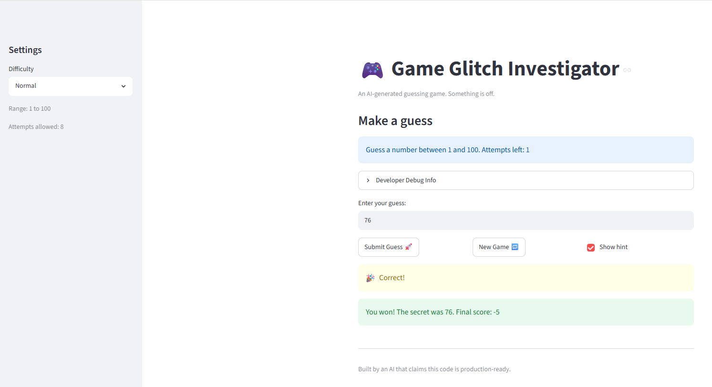
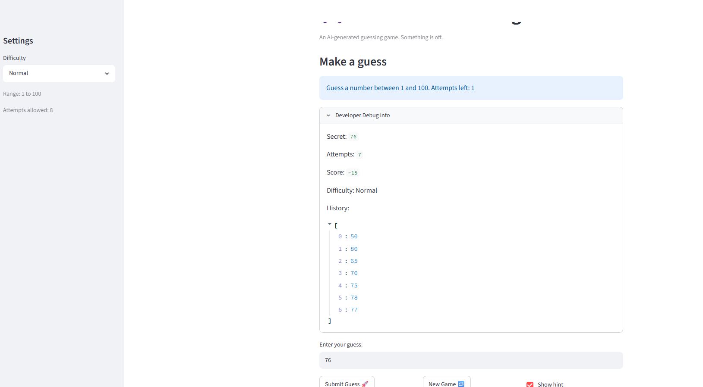

# 🎮 Game Glitch Investigator: The Impossible Guesser

## 🚨 The Situation

You asked an AI to build a simple "Number Guessing Game" using Streamlit.
It wrote the code, ran away, and now the game is unplayable. 

- You can't win.
- The hints lie to you.
- The secret number seems to have commitment issues.

## 🛠️ Setup

1. Install dependencies: `pip install -r requirements.txt`
2. Run the broken app: `python -m streamlit run app.py`

## 🕵️‍♂️ Your Mission

1. **Play the game.** Open the "Developer Debug Info" tab in the app to see the secret number. Try to win.
2. **Find the State Bug.** Why does the secret number change every time you click "Submit"? Ask ChatGPT: *"How do I keep a variable from resetting in Streamlit when I click a button?"*
3. **Fix the Logic.** The hints ("Higher/Lower") are wrong. Fix them.
4. **Refactor & Test.** - Move the logic into `logic_utils.py`.
   - Run `pytest` in your terminal.
   - Keep fixing until all tests pass!

## 📝 Document Your Experience

- [ ] Describe the game's purpose.
The game's purpose is to let the user guess the correct secret number. With every guess, there will be hints given, if the user keeps the hint box checked, indicating whether the guess should be higher or lower. You are given a specific number of attempts based on which diffiuclty you play in.

- [ ] Detail which bugs you found.
One bug found is that we are not given 8 attempts starting out the game, the message says there are 7 attempts left even though we should have 8. Another bug found is that the hint is incorrect in multiple ways. One specific way is that when the guess is a single digit number and the secret number is a double or triple digit number, and the first digit of the secret number is lower than the single digit guess, the wrong hint or result is given back. For example, if the  secret number is 88, and our guess is 9, the hint given back will be Go Lower rather than Go Higher. This is becuase 9 is greater than the first digit of 88, which is 8. Another bug found is the starting attempt number is 7, which is incorrect and should be 8 for normal difficulty.

- [ ] Explain what fixes you applied.
One fix applied is that the st.session_state.attempts needs to be initialized to 0 if "attempts" not in st.session_state, which should be the case if we start out with it. 


## 📸 Demo Walkthrough

Describe your fixed game in numbered steps so a reader can follow along without watching a video:

1. Click on the developer debug info box to toggle the full box of hints and see the secret number, attempted guesses, current score, difficulty, and the history of guesses. Observe that we start out with 8 attempts left when we boot the game at the very top instructions: Guess a number between 1 and 100. Attempts left: 8."
2. Click on the enter your guess box and enter a number between 1 and 100. Say you enter 1.
3. Click on submit guess button. The hint should show "Go Higher!"
4. Enter a guess that is lower than the secret number but is a single digit number. Also, that number must be higher than the first digit of the secret number if the secret number is more than 1 digit. The hint should show "Go Higher!" 

For example, we can guess 5. The hint should show "Go Higher!" This should show that given a single digit number guess despite if the first digit of the acctual secret number is lower than the single digit number. In this case, the guess 5 should in general be lower than the secret guess 44, which shoudl show the hint "Go Higher!"
5. Guess a number that is higher than the actual secret number. For example, 50 if the secret number is 44. The given hint should be Go LOWER!
6. Guess the correct secret number (44) and the result hint should be 🎉
Correct! Game will end after the correct guess. 


**Screenshot** *(optional)*: <!-- Insert a screenshot of your fixed, winning game here -->



## 🧪 Test Results

```
# Paste your pytest output here, e.g.:
# pytest tests/
# ========================= X passed in 0.XXs =========================


============================================================================================================ test session starts ============================================================================================================
platform win32 -- Python 3.14.5, pytest-9.0.3, pluggy-1.6.0
rootdir: C:\Users\Lily Thai\Documents\Codepath Github\ai110-module1show-gameglitchinvestigator-starter
plugins: anyio-4.13.0
collected 7 items                                                                                                                                                                                                                            

tests\test_game_logic.py .......                                                                                                                                                                                                       [100%]

============================================================================================================= 7 passed in 1.13s

```

## 🚀 Stretch Features

- [ ] [If you choose to complete Challenge 4, describe the Enhanced UI changes here — a screenshot is optional]
